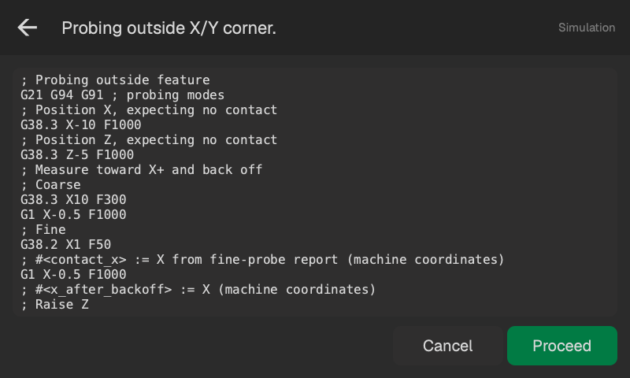
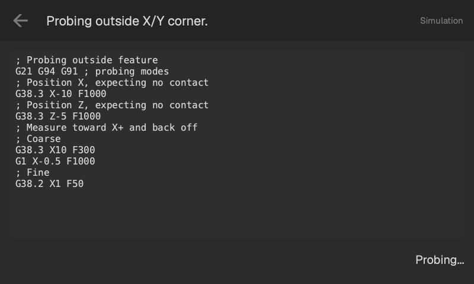

# Operator guide

Use the probe to find an edge, corner, surface or center, then set work zero from the measurement.

## First measurement

1. Home the machine, stop the spindle and secure the stock.
2. Open probing with the probe-ball button beside Wi-Fi.
3. Leave room for the probe to extend, then use the top-row switch.
4. Check **Settings**, especially the ball diameter and feeds. Position the ball with the machine's controls or MPG.
5. Choose a tab and enter the distances for your feature. Use the guides below to check the starting position.
6. Tap the picture of the surface or feature you want. Check the moves, then press **Proceed**.
7. Read the result. To use it as work zero, enter any offsets and press **Set Work Zero**. Use the positioning button when needed, then press **Close**.

## Pick a routine

| Tab | Use it for |
| --- | --- |
| [Outside](outside.md) | A side or corner of stock, or its top surface |
| [Inside](inside.md) | A wall or corner inside an opening, or its bottom |
| [Center](center.md) | The center of a boss, block, hole, pocket, ridge or valley |
| [Settings](settings.md) | Ball diameter, backoff, feeds and repeatability check |

In the button pictures, the crosshair is the starting position of the probe ball, the arrows point towards the surfaces to touch, and the green dot is the point being measured. Z measures straight down. Distances are in mm and feeds in mm/min.

## Top row

The large coordinates are relative to the selected work zero. The smaller numbers below them are machine coordinates (G53).

Tap the **G54** (or other G-number) to choose a work coordinate system. Each one has its own zero. Check this before probing: it is the coordinate system the results page will set.

The probe switch extends or retracts the probe independently of a routine. Tabs remain switchable while retracted; probing controls become available when the probe is extended. Settings are available with the machine connected. The **?** button opens help for the current tab.

The back arrow leaves probing. If the probe is extended, it asks whether to retract it or leave it extended.

[Editing values](editing.md)

## Review and run

The heading names the measurement. The scrollable G-code lists every planned move, with comments. Values such as `#<x_after_backoff>` stand for positions that will only be known after a touch. The log fills those in as the routine runs.

Check the directions, distances and clearance, including the return path. **Cancel** and the back arrow return to the controls. **Proceed** starts motion.

Each surface gets a coarse touch, a short backoff, a slow fine touch and another backoff. The fine touch supplies the measurement. The log shows the moves and their progress.

[Results and work zero](results.md)

[Clearance and failed probing](safety.md)

Screenshots use simulated stock in the local preview.

[Probe repeatability](repeatability.md)
