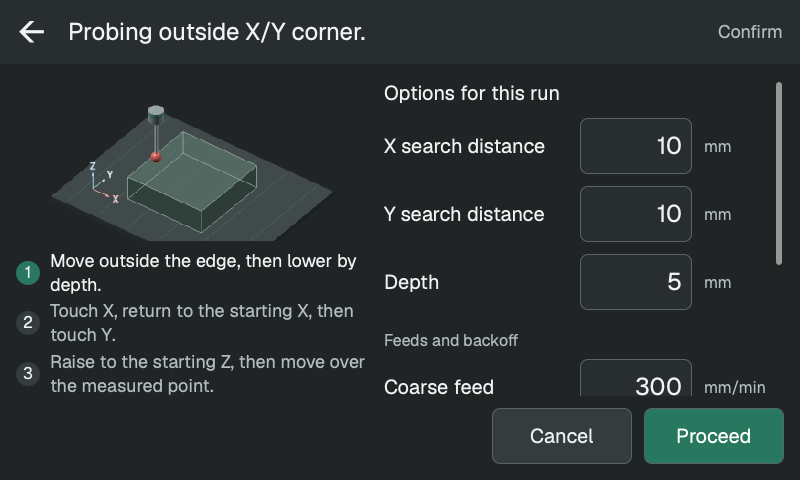

# Probing guide

Choose a measurement:

- [Outside](outside.md): stock edge, outside corner or top surface.
- [Inside](inside.md): pocket wall, inside corner or bottom surface.
- [Center](center.md): boss, block, hole, pocket, ridge or valley center.
- [Angle](angle.md): face angle in X/Y or Z slope along X or Y.
- [Rotary](rotary.md): rotary axis center or a face's angle.

The crosshair marks the **probe ball's** starting position. White arrows show movement; crossed circles show downward touches in a top view.

References use the axis colors: **X red, Y green, Z blue**. A dot marks a possible zero point, a line or shaded area marks a zero plane, and an angled line shows the measured direction. These marks show what you can set from the result; measuring alone leaves the WCS unchanged.

<!-- guide-only -->

<!-- /guide-only -->

## Starting a measurement

Select a picture to open the confirmation screen. It shows the route. Compare that route with your stock and clamps, including the probe shaft's clearance.

You can change distances and feeds here for this run only. **Proceed** starts from the ball's position at that moment, so you can still jog before pressing it. **Cancel** returns without moving.

<!-- guide-only -->

<!-- /guide-only -->

The probe touches each surface twice: a coarse search, backoff, then a slower fine touch. The fine touch supplies the measurement.

[Results and setting work zero](results.md)

## Coordinates and controls

- Large readouts use the selected work coordinate system; small readouts use machine coordinates, G53.
- Tap the coordinate readout to switch between **Probe** and **Tool**. With an empty spindle, Tool still uses the last measured tool length offset.
- **G54–G59** selects a work coordinate system. Each stores its own zero.
- Tap **Retracted / Extended** beside the tabs to extend or retract the probe independently of measurements. The highlighted label shows its current state.
- **?** highlights the controls. Tap one for an explanation, or **Guide** for these pages. **×** leaves help.

## Contact and failures

Sideways and downward positioning moves stop on ball contact. Jogging and ordinary upward moves do not. A shaft collision may never trigger the ball.

If the first search misses, the measurement fails. If the fine touch misses, the firmware can alarm and return you to the machine's main screen. Check the search distance and starting position before retrying.

## Other pages

- [Settings](settings.md): ball diameter, backoff, feeds and updates.
- [Editing numbers](editing.md)
- [History and logs](history.md)
- [Repeatability check](repeatability.md)
