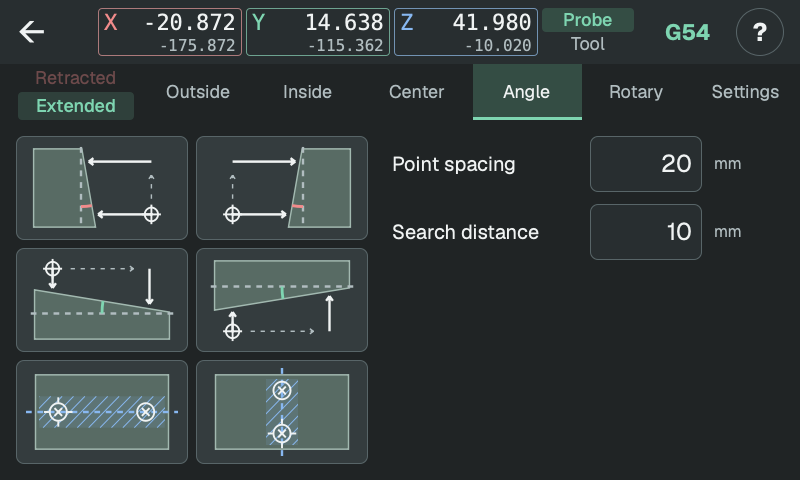

# Angle

Measure a straight face at two points. The probe returns to its starting position.

<!-- guide-only -->

<!-- /guide-only -->

## Choose a direction

**X− / X+** search sideways in X, with the second touch farther along Y+.
**Y− / Y+** search in Y, with the second touch farther along X+.
Start beside the face at the height you want to measure.

**Z along X / Z along Y** touch downward twice, moving along X+ or Y+ between touches. Start above the first point, high enough to clear both points.

## Distances

- **Point spacing:** travel along the face between touches. A larger spacing makes small angle differences easier to measure.
- **Search distance:** maximum travel toward the face at each point.

Both points must be on the same flat face. The probe backs out to its starting clearance before moving between them.

## Results

The angle is measured relative to the machine axes. Positive X/Y angles are counterclockwise when viewed from above; positive Z slopes rise along X+ or Y+.

On community firmware, select a WCS and press **Set X/Y rotation** to align it with the face. Its zero stays in place. You can apply the same measurement to another WCS or reopen it from [history](history.md).
