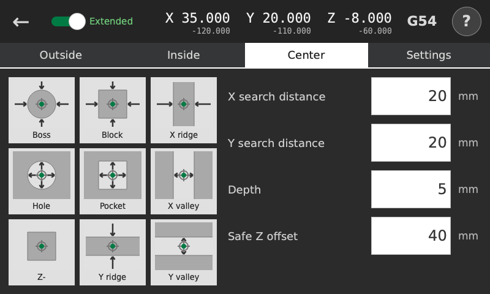
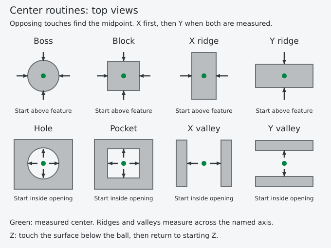

# Center

<!-- guide-only -->

<!-- /guide-only -->

## What the buttons measure

Boss and Hole measure a round feature. Block and Pocket measure opposing X and Y faces. X ridge and X valley measure only across X; Y ridge and Y valley measure only across Y. The letter names the measuring axis, not the long direction of the feature.

Each axis is touched on both sides and the midpoint is calculated. Two-axis routines find X first, move the ball to that X center, then measure Y. Z is the same downward surface probe as on the other tabs.

## Where to start

Boss, Block and ridges: start roughly centered above the stock. Starting Z is the clearance height for sideways travel. Choose a height that clears the stock and fixtures along the whole route.

Hole, Pocket and valleys: start roughly centered inside the opening, with the ball at the height where you want the X/Y touches.

## X search distance and Y search distance

Each distance sets the reach on both sides of the starting coordinate. X search distance 20 gives X boundaries at starting X - 20 and starting X + 20. Y works the same way, including for round features.

For Boss, Block and ridges, these are the outward positioning distances. The probe lowers at each boundary and searches inward towards the starting coordinate. Choose enough distance to put the whole ball beyond each stock edge, allowing for an off-center start. It raises to starting Z before crossing the stock.

For Hole, Pocket and valleys, the boundaries are the furthest positions each coarse search can reach. The second search crosses from the first wall's backoff position towards the opposite boundary. With X search distance 20, that stroke can be nearly 40 mm long. Both boundaries stay tied to the starting X.

Ridges and valleys use the search distance for their measuring axis.

## Depth

For Boss, Block and ridges, how far below starting Z to touch the sides. Hole, Pocket and valley touches happen at starting Z.

For Z, the maximum downward search distance. Z always returns to starting Z.

[Results and work zero](results.md)

[Safe Z offset](safe-z.md)

## Where it finishes

After the last touch and backoff, Boss, Block and ridges raise to starting Z. Hole, Pocket and valleys raise by Safe Z offset to clear the rim. The probe then moves the ball to the measured center in one X/Y move. Ridges and valleys move only their measured axis.

Between touches, Boss, Block and ridges cross the stock at starting Z. Internal two-axis routines center X at probing height before measuring Y.

Z always returns to starting Z.

## Things to check

These routines assume a clear route between opposing faces. Do not use them across a pocket with islands or through a feature that narrows around the shaft. Secure the stock; it must not move when touched.

[Clearance and failed probing](safety.md)
