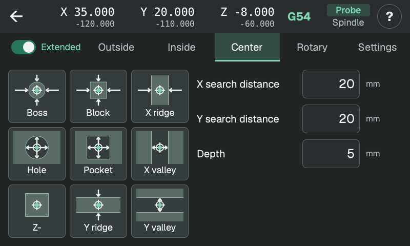
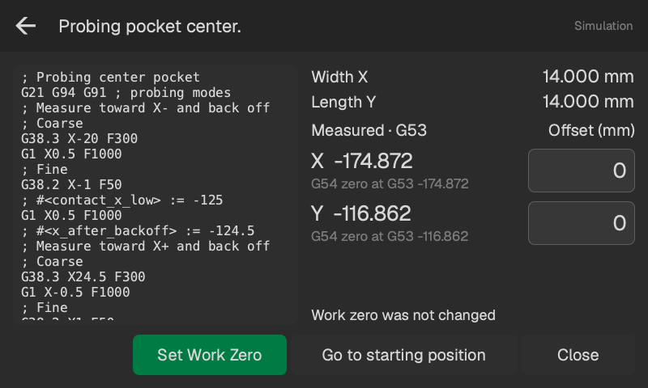

# Center

These routines touch opposite surfaces and find their midpoint.

<!-- guide-only -->

<!-- /guide-only -->

## Choose the measurement

- **Boss / Hole:** round outside / inside feature; measure X and Y.
- **Block / Pocket:** rectangular outside / inside feature; measure X and Y.
- **X ridge / X valley:** raised strip / slot; measure across X only.
- **Y ridge / Y valley:** raised strip / slot; measure across Y only.
- **Z:** touch a surface downward and return to starting Z. **Depth** sets the maximum search.

X and Y name the direction **across** the feature, not its long direction.

## Boss, block or ridge

Start roughly centered above the feature. Starting Z must clear it during crossings.

**X/Y search distance** is the outward travel from the start to each side, not the feature's width. Choose enough to put the whole ball beyond both edges. **Depth** is the drop from starting Z to the side-touch height, including the gap above the stock.

The probe lowers outside each side and touches inward. It rises to starting Z before crossing to the other side. After measuring, it finishes above the center at starting Z.

## Hole, pocket or valley

Start roughly centered inside the opening at measurement Z. **X/Y search distance** is the maximum travel from the start toward either wall. A value of 20 permits searches to starting coordinate −20 and +20, not a total width of 20.

The probe crosses between walls at this height, so that route must be clear. **Depth** is unused. It finishes at the measured center without raising Z.

## Measurements

Two-axis routines measure X first, move to the X center, then measure Y. Ridges and valleys move only their measured axis to the center.

Results show width and length for blocks/pockets, width for ridges/valleys, and separate X/Y spans for bosses/holes. These include ball-radius compensation. On round features, an off-center start can shorten the first X span; probe again from the center if you need a centered diameter measurement.

<!-- guide-only -->

[Set work zero from the result](results.md)
<!-- /guide-only -->
