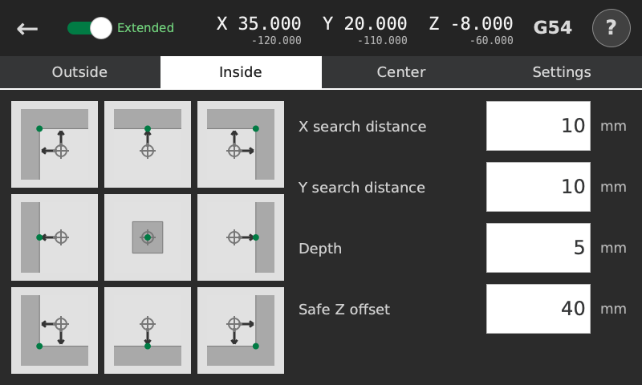
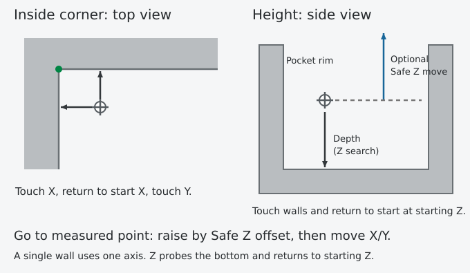

# Inside

<!-- guide-only -->

<!-- /guide-only -->

## Where to start

Put the extended probe ball inside the opening, near the wall or corner you want to measure, at the height where you want the X/Y touches.

The arrows point towards the walls being measured. X/Y touches happen at starting Z. Corners measure X, return to starting X at that height, then measure Y.

## X search distance and Y search distance

How far from starting X or Y the probe may search towards a wall. With X search distance 10, an X+ search ends at starting X + 10 if it reaches the limit before touching. An X- search ends at starting X - 10.

Choose enough distance to reach the wall along each measuring axis.

## Depth

For Z, the maximum downward search distance to find the bottom. After a successful Z touch, the probe returns to its starting Z.

[Results and work zero](results.md)

[Safe Z offset](safe-z.md)

## Where it finishes

After the last touch and backoff, the probe raises by Safe Z offset, then moves the ball over the measured wall or corner. An unmeasured axis stays where it is. Choose enough clearance to get above the pocket rim before that sideways move.

Z always returns to its starting height.

## Watch the route

A return across a pocket can hit an island or an overhang even when both endpoints are clear.

[Clearance and failed probing](safety.md)
