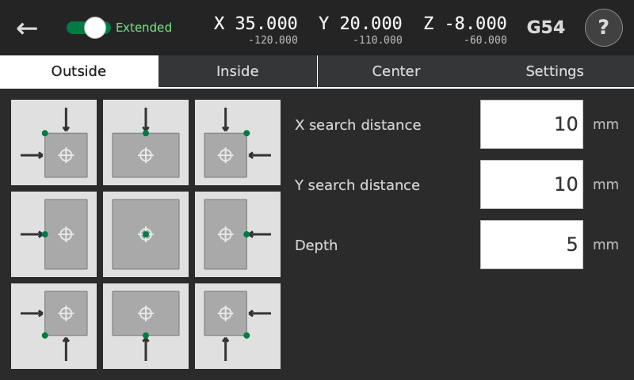
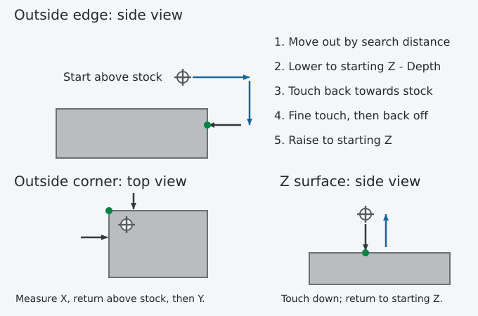

# Outside

<!-- guide-only -->

<!-- /guide-only -->

## Where to start

Extend the probe with the top-row switch, then position the ball above the stock, near the edge or corner you want to measure. The arrows show the directions of the measuring strokes; the green dot marks the measured point.

Tap a button to review the moves. Nothing moves until you press Proceed.

## X search distance and Y search distance

How far to move the probe ball out from its starting X or Y before lowering beside the stock. The probe then searches back towards the starting coordinate. Corners do this separately for X and Y.

For example, X search distance 10 puts the lowering position 10 mm from starting X. Choose a distance that puts the whole ball beyond the edge, with room for positioning error. Check that the outward position clears clamps and stays within machine travel.

## Depth

For an edge or corner, how far below starting Z to touch the side. Starting Z -60 with Depth 5 gives a probing height of G53 Z-65.

For Z, this is the maximum downward search distance. Z probing always returns to its starting height.

[Results and work zero](results.md)

## Where it finishes

After measuring, the probe raises to starting Z, then moves the ball over the measured edge or corner. An unmeasured axis stays where it is. Z probing returns to its starting height.

Sideways positioning before and between measurements also uses starting Z. Choose a starting height that clears the stock and fixtures along the whole route.

[Clearance and failed probing](safety.md)
