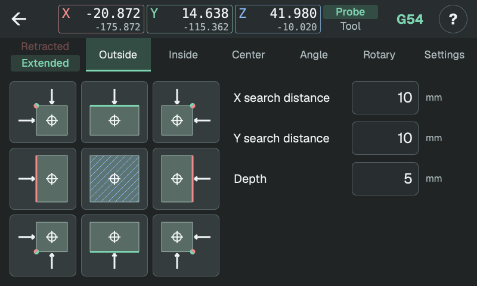
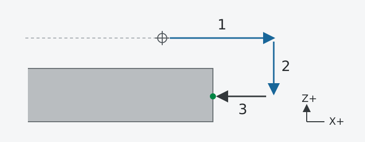

# Outside

The four side pictures measure a stock edge; the four corner pictures measure X and Y. The middle picture measures a top surface.

<!-- guide-only -->

<!-- /guide-only -->

## Edge or corner

Place the ball above the stock, slightly inward from the chosen edge or corner. Starting Z is the clearance height for all moves across the stock.

1. Move outward by **X search distance** or **Y search distance**, measured from the start. Choose enough distance to put the whole ball beyond the edge.
2. Lower by **Depth** from starting Z. Include the gap above the stock plus how far below its top you want the side touch.
3. Probe inward toward the starting X or Y.

For a corner, X is measured first. The probe rises to starting Z and returns to starting X before approaching the Y edge. Use both search distances; a single edge uses only its axis's distance.

After measuring, the ball rises to starting Z and moves above the measured edge or corner.

## Top surface

Place the ball above the point you want to measure. **Depth** is the maximum downward search from there. X/Y search distances are unused.

The probe returns to starting Z after the touch.

<!-- guide-only -->
[Set work zero from the result](results.md)
<!-- /guide-only -->
