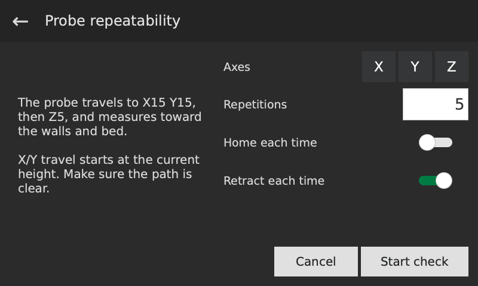
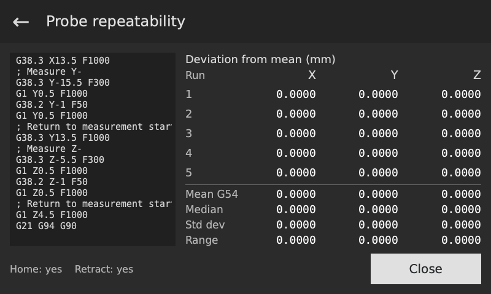

# Probe repeatability

Use **Probe repeatability** in Settings to measure the same reference surfaces several times.

## Prepare

Set G54 X and Y zero on the inside corner of the L bracket at the bottom left of the table. Set G54 Z zero on the bed. Select G54, leave room for the probe to extend, then confirm **G54 is ready**.

The measuring point is 15 mm into the bracket along both axes, with the probe tip 5 mm above the bed. Clear the path to this point. With homing off, X/Y travel happens at the current height before Z moves to 5 mm.

## Options

<!-- guide-only -->

<!-- /guide-only -->

- **Axes:** choose X, Y and/or Z. All three are selected initially.
- **Repetitions:** how many times to measure each selected surface. The default is 5.
- **Home each time:** home before every repetition, including the first. This includes homing variation and turns on retraction. Starts off.
- **Retract each time:** retract and extend the probe between repetitions. This includes deployment variation. Starts on.

The check uses the ball diameter, feeds and retract distance from Settings.

## Running

Press **Start check**. With homing off, an already-extended probe stays extended for the initial approach. A retracted probe extends after reaching X15 Y15 Z5.

With homing selected, an extended probe first moves to X15 Y15 at its current height and retracts there. The machine then rapids to machine Z0, then machine X-20 Y-5, and homes. This leaves the final approach to the X/Y switches to the slow homing cycle. It extends the probe at home, returns to X15 Y15, and lowers to Z5 using contact-guarded moves. Between repetitions, retraction happens at the measuring point before any Z lift.

The probe moves to X15 Y15, then Z5. X probes toward X-, Y toward Y-, and Z toward the bed. Each selected axis gets the usual coarse and fine touches, then returns to the measuring point before the next axis. After the last repetition, the probe stays extended at X15 Y15 Z5.

G54 keeps the zero you set before the check. If a movement or measurement fails, the check stops and keeps the readings collected so far.

## Results

<!-- guide-only -->

<!-- /guide-only -->

While running, each row shows the measured G54 coordinates in millimeters. When the check ends, the rows show each measurement's deviation from that axis's mean. A positive value is above the mean; a negative value is below it.

- **Mean G54:** the average measured coordinate.
- **Median:** the middle reading after sorting; for an even number, the average of the middle two.
- **Std dev:** sample standard deviation, showing how much the readings scatter. It needs at least two readings.
- **Range:** highest reading minus lowest reading.

The summary updates after every measurement, using the readings collected so far for each axis. Mean and median are G54 coordinates. Homing and retraction choices are shown below the results.
