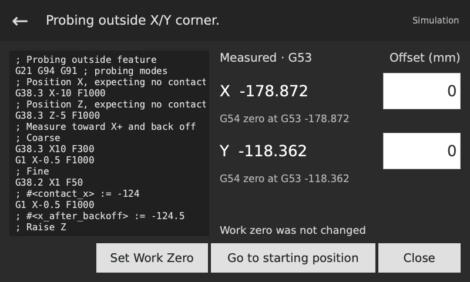
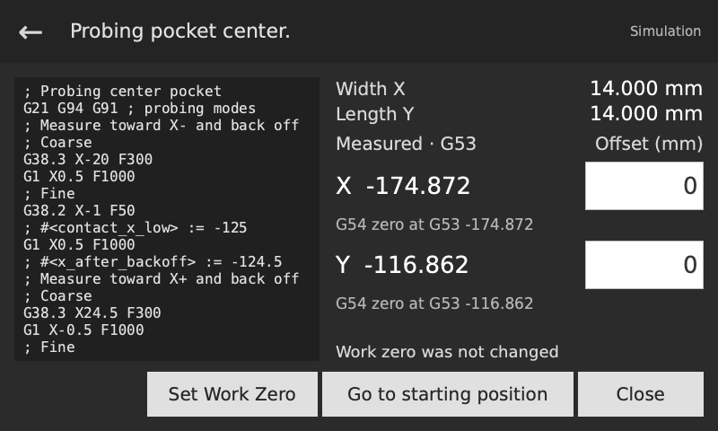

## Results and work zero

Results show the measured point in G53 (machine coordinates), including probe calibration and ball-radius compensation. Use Set Work Zero to place the work origin at that point or at an offset from it.

Center routines also show the size in mm above the coordinates:

- Block and Pocket: Width X and Length Y.
- Ridges and valleys: width across the measured axis.
- Boss and Hole: Span X and Span Y. For a centered comparison, probe again from the measured center.

Sizes include ball-radius compensation. They are the distances between the touched surfaces; roughness, tapered walls and probe deflection affect the reading.

Enter an Offset for each measured axis, then press Set Work Zero. The new WCS origin is the measured G53 coordinate plus that offset. For example, Z25 with offset -2 places Z zero at G53 Z23. Zero offsets put the origin at the measured point. This updates the measured axes of the selected WCS while the machine stays in place.

The keypad opens when you tap an offset. Use ± for a negative value and Enter to accept it. After the machine confirms the change, the page says Work zero set. The measured coordinates stay unchanged.

For Outside and Center results, **Go to starting position** moves X/Y together to where you started, then returns Z to its starting height. You can do this before or after setting work zero; it uses the saved machine position. The downward move is contact-guarded. Z-only probing already returns to the start.

Inside X/Y probing already finishes at its starting X/Y and probing height. **Go to measured point** raises by the displayed Safe Z offset, then moves the ball over the measured wall or corner. You can edit the offset before moving.

**Close** returns to the probing controls, leaving the machine at its current position.

<!-- guide-only -->

[Back to the operator guide](README.md)
<!-- /guide-only -->
