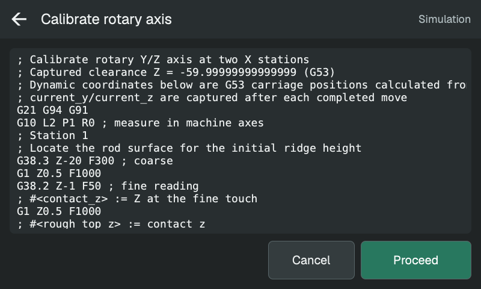
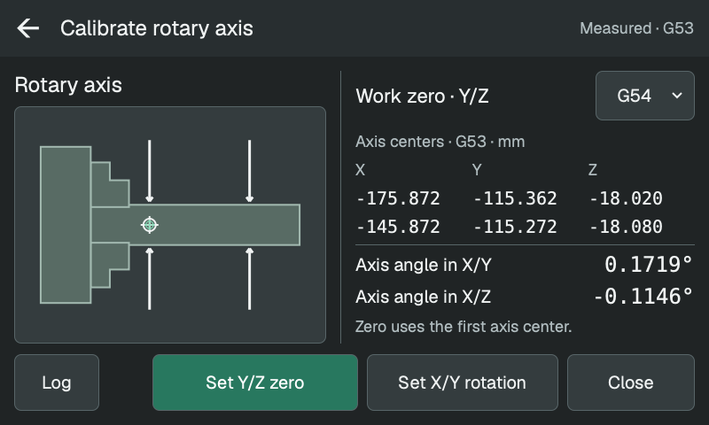
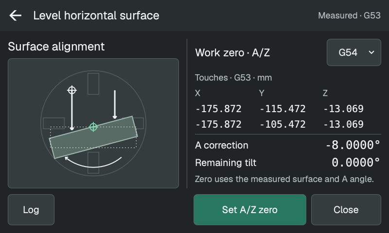

# Rotary

Choose the operation by its button:

- **Upper left:** find the rotary axis Y/Z center and its alignment to X travel.
- **Lower left:** level a horizontal flat surface.
- **Upper right:** align a vertical flat surface by probing toward Y+.
- **Lower right:** align a vertical flat surface by probing toward Y−.

<!-- guide-only -->

<!-- /guide-only -->

## Before starting

Home the machine, stop the spindle and select the WCS you want to use. Extend
the probe and position its ball as described for the operation below. Check
clearance for the ball and shaft, the chuck jaws, fixtures and the workpiece
throughout rotation.

The white crosshair on each button marks the starting position. The green
crosshair marks the zero you can save after measuring. On the leveling buttons,
the solid shape is the surface being probed; the dotted outline is its aligned
position. The arrows show the probing direction.

The probe ball diameter, backoff and feeds come from Settings. **Rotary feed**
sets the maximum A speed in degrees per minute; XYZ positioning uses the
positioning feed. Check the probe calibration before taking measurements.

Press the operation's button, review the G-code and press **Proceed**. Saving
zeros or setting work-coordinate rotation is a separate action on the results
screen, with confirmation.

## Calibrate the rotary axis

Clamp a smooth round rod in the chuck. Choose two places along it where the
probe can reach the top and both sides, clear of the jaws and tailstock.
Position the probe ball a few millimeters above the crest at the first place.
This starting Z is the clearance height for crossing the rod and following it
as it turns. Check clearance for the whole shaft down both sides.

- **Rod diameter:** the measured diameter in mm, used to estimate the first
  side approaches.
- **X distance:** the signed distance from the first place to the second.
  Positive moves X+, negative moves X−. A larger separation makes small
  alignment differences easier to measure. Both places must be on the smooth
  part of the rod.

### How it measures

At each place, the probe finds an initial top height, measures the Y midpoint
and touches the crest above that midpoint. The chuck then turns 90° each way
while the probe follows the crest, so both side measurements touch the same
part of the rod. Their midpoint gives the rotary axis Y center; their span and
the top touch give its Z center. Another pair of side touches refines the
measurement to account for chuck runout.

A returns to its starting angle between sides and before moving to the second
place. The probe crosses the rod at the starting height.

Community firmware uses Y/Z arcs with simultaneous A movement. Stock firmware
uses short coordinated probing moves along the same path. An unexpected touch
during those positioning moves stops the calibration.

<!-- guide-only -->

<!-- /guide-only -->

### Results

The result shows both axis centers in G53 and two angles:

- **Axis angle in X/Y:** the sideways angle of the rotary axis relative to X
  travel.
- **Axis angle in X/Z:** its vertical angle, for mechanically adjusting the
  rotary unit.

**Set Y/Z zero** puts the first center at Y0/Z0 in the selected WCS, keeping its
X origin. **Set X/Y rotation**, available with community firmware, sets the
WCS's X/Y rotation to the measured angle.

The probe returns to the first X position, at the starting Z and A angle.
Check clearance before jogging away or retracting it.

<!-- guide-only -->

<!-- /guide-only -->

## Level a horizontal surface

Hold the workpiece in the chuck with the flat face within 20° of horizontal.
Position the probe above the first point, toward the Y− end of the face. Choose
a starting Z that clears the workpiece as it rotates.

- **Y distance:** the Y+ move from the first point to the second. Both points
  must lie on the flat face, at the same X.
- **Z distance:** the maximum downward search from the starting Z at each point.

The probe measures the first point, returns to the starting Z, moves Y+ and
measures the second point. It returns to the starting Z and Y before rotating
A to level the face, then measures both points again. Small remaining angles
are corrected and checked again, up to three times.

The results show the two verified touches in G53, the total A correction and
the remaining tilt. **Set A/Z zero** sets A0 at the corrected angle and Z0 at
the mean measured surface height in the selected WCS.

The probe finishes at the starting X/Y/Z, with A left at the corrected angle.

<!-- guide-only -->

<!-- /guide-only -->

## Align a vertical surface

Hold the workpiece with the flat face within 20° of vertical. Use the
upper-right button to approach from the Y− side and probe toward Y+, or the
lower-right button to approach from the Y+ side and probe toward Y−.

Position the ball beside the upper touch point. The top of the face should
lean away from the probe shaft, as shown in the button. Leave enough clearance
to rotate the workpiece with the probe at this starting position.

- **Y distance:** the maximum search toward the face from the starting Y.
- **Z distance:** the downward move from the first touch height to the second.
  Both heights must lie on the flat face, clear of its edges and fixtures.

The probe measures the upper point, returns to the starting Y, moves down and
measures the lower point. It returns to the starting Y and Z before rotating
A to align the face, then measures both points again. Small remaining angles
are corrected and checked again, up to three times.

The results show the two verified touches in G53, the total A correction and
the remaining tilt. **Set A/Y zero** sets A0 at the corrected angle and Y0 at
the mean measured face position in the selected WCS.

The probe finishes at the starting X/Y/Z, with A left at the corrected angle.

<!-- guide-only -->

<!-- /guide-only -->
