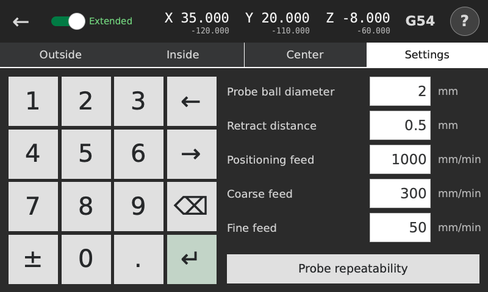

# Settings

<!-- guide-only -->

<!-- /guide-only -->

[Editing values](editing.md)

Distances are in millimeters and feeds are in millimeters per minute, even if the machine was in inch mode before probing.

## Probe ball diameter

The diameter of the probe ball. The measured surface is corrected by half this value in the touch direction. A wrong diameter gives a wrong surface coordinate.

The probe's offset from the spindle comes from the machine calibration.

## Retract distance

How far to back away along the measuring axis after each touch: once after the coarse touch and again after the fine touch.

It must be enough for the probe to release. The fine stroke searches back to the coarse contact position, with another 0.5 mm allowed beyond it.

## Positioning feed

Speed for moves between touches and for backing off after a touch. Keep it low enough for the probe and the available clearance.

Upward Z moves and releases from a measured surface use G1. Other positioning moves use G38.3 and fail the routine if contact occurs.

## Coarse feed

Speed of the first search for each surface. It finds an approximate contact position. The probe then backs off by Retract distance.

## Fine feed

Speed of the second touch. This touch supplies the measurement. A slower feed reduces the effect of deflection and stopping delay. If the fine touch fails, the firmware can raise an alarm that must be cleared on the main screen.

[Clearance and failed probing](safety.md)

[Probe repeatability](repeatability.md)
