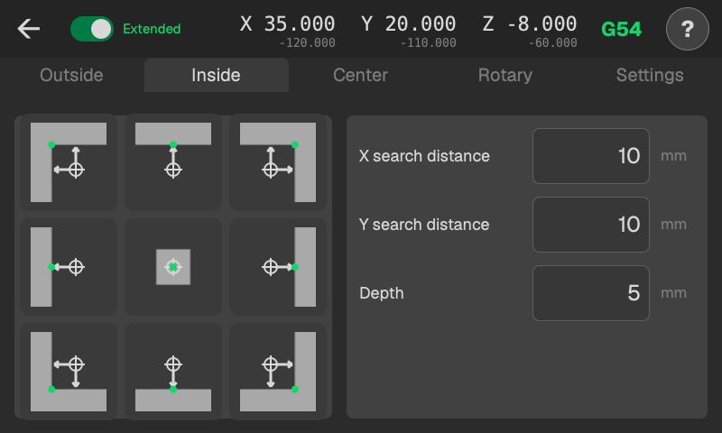
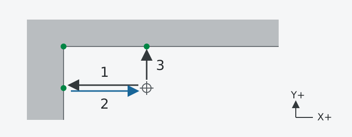

# Invändigt

De fyra sidbilderna mäter en invändig vägg; de fyra hörnbilderna mäter X och Y. Mittbilden mäter botten.

<!-- guide-only -->

<!-- /guide-only -->

## Vägg eller hörn

Placera kulan inne i öppningen på den höjd där väggarna ska mätas.

**X-söksträcka** och **Y-söksträcka** är de längsta sträckor kulan får röra sig från startläget mot respektive vägg. Välj sträckor som räcker fram till väggen. Ett hörn använder båda; en enskild vägg använder bara sträckan för sin axel.

Vid ett hörn:

1. Proba X-väggen.
2. Återgå till startläget i X.
3. Proba Y-väggen.

Alla dessa rörelser sker på starthöjden i Z; **Djup** används inte.

Proben slutar i startläget för X/Y och Z.

## Bottenyta

Placera kulan ovanför botten. **Djup** är den största söksträckan nedåt från det läget. Proben återgår sedan till starthöjden i Z.

## Kör över mätpunkten

Resultatsidans **Till uppmätt XY** höjer kulan med **Säkert Z-lyft** och kör den sedan över den uppmätta väggen eller hörnet. Välj ett lyft som ger frigång över fickans ovankant och eventuella spännjärn längs vägen. Det är en sträcka upp från aktuell Z-höjd, inte en absolut höjd.

<!-- guide-only -->
[Sätt arbetsnollpunkten från resultatet](results.md)
<!-- /guide-only -->
