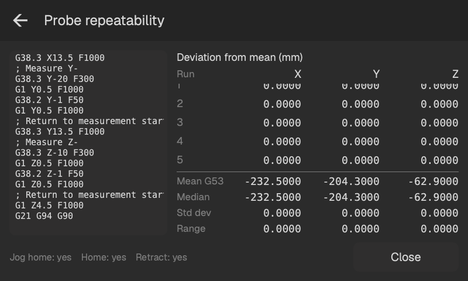

# Repeterbarhetskontroll

Öppna **Inställningar → Hjälpfunktioner → Probens repeterbarhet**. Montera den höga L-vinkeln i bordets nedre vänstra hörn och referenskör maskinen. Rutinen använder maskinkoordinater för att nå den, så ingen arbetsnollpunkt behövs.

Utan förflyttning till referensområdet sker den första X/Y-förflyttningen på aktuell Z-höjd. Börja tillräckligt högt för att ge frigång över bordets fixturer.

## Alternativ

- **Axlar:** välj vilka av vinkelns väggar och/eller bordets yta som ska mätas.
- **Upprepningar:** mätvärden per axel; standard 5.
- **Fäll in varje gång:** ta med variationen från infällning och utfällning av proben.
- **Kör hem varje gång:** fäll in, kör till G53 Z0 och sedan X−20 Y−5 och återgå före mätningen.
- **Referenskör varje gång:** referenskör också vid varje besök i referensområdet.

De två hemalternativen inkluderar infällning. Utan dem fälls proben in vid vinkelns mätläge.

Kulan kör till 15 mm från varje vägg och 5 mm ovanför bordet och probar sedan de valda ytorna. **Stoppa** avslutar kontrollen när den aktuella rörelsen eller kontakten är klar. De senaste mätvärdena behålls.

## Läs resultaten

Raderna visar G53-mätvärden under kontrollen och därefter avvikelser från varje axels medelvärde. Sammanfattningen uppdateras efter varje kontakt.

- **Medel G53:** medelkoordinat.
- **Median:** det mittersta värdet efter sortering, eller medelvärdet av de två mittersta vid ett jämnt antal.
- **Std.avv.:** stickprovsstandardavvikelse; kräver minst två mätvärden.
- **Spännvidd:** högsta mätvärdet minus det lägsta.

<!-- guide-only -->

<!-- /guide-only -->
