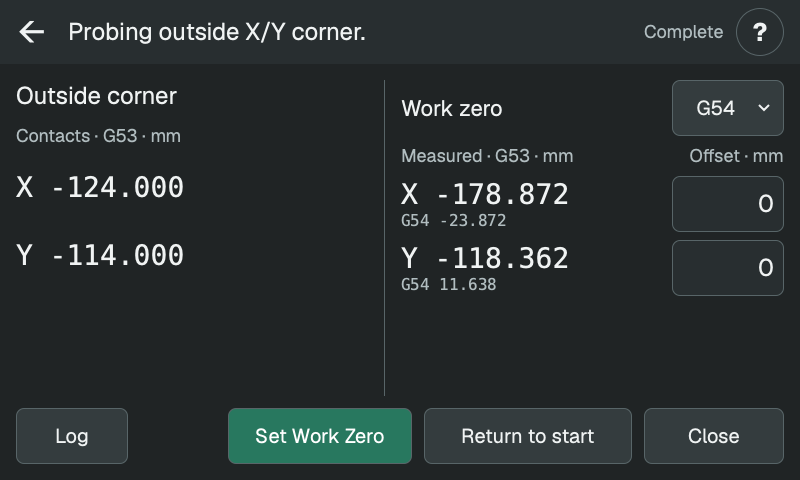

# Resultat och arbetsnollpunkt

De stora koordinaterna visar den uppmätta ytan eller centrumet i **G53**. De mindre koordinaterna visar samma punkt i valt **G54–G59**. Probkalibrering och kompensation för kulradien är redan tillämpade.

Vid centrummätningar inkluderar **Mått** kulkompensation; **Råmått** är avståndet mellan finkontakterna före kompensation. Kant- och Z-resultat visar okompenserade maskinkoordinater under **Kontakter**.

<!-- guide-only -->

<!-- /guide-only -->

## Sätt arbetsnollpunkt

Välj WCS bredvid **Arbetsnollpunkt**, ange förskjutningar vid behov och tryck på **Sätt nollpunkt**. Bara uppmätta axlar ändras. Maskinen står stilla.

Varje ny nollpunkt är **uppmätt G53-koordinat + Förskjutning**. Om Z till exempel mäts till 25 och du anger −2 ligger Z0 vid G53 Z23.

Du kan ändra förskjutningarna och sätta nollpunkten igen, eller välja ett annat WCS och sätta dess nollpunkt från samma mätning.

## Positioneringsknappar

- **Till startläget:** kör X/Y till det sparade startläget och sedan Z. Finns för resultat från Utvändigt och Centrum.
- **Till uppmätt XY:** på Invändigt-resultat för väggar och hörn, höj med **Säkert Z-lyft** och kör sedan kulan över mätpunkten. Lyftets sträcka räknas från aktuell Z-höjd.
- **Stäng:** lämna resultatet utan rörelse.

Dessa mål placerar **probkulan**, inte spindeln. Rutiner som bara mäter Z har redan återgått till startläget.

## Sparade mätningar

Öppna **Inställningar → Hjälpfunktioner → Probhistorik**, välj en mätning och sedan **Öppna resultat**. Du kan sätta arbetsnollpunkten från den senare, så länge ämnet och maskinens referens är oförändrade.
