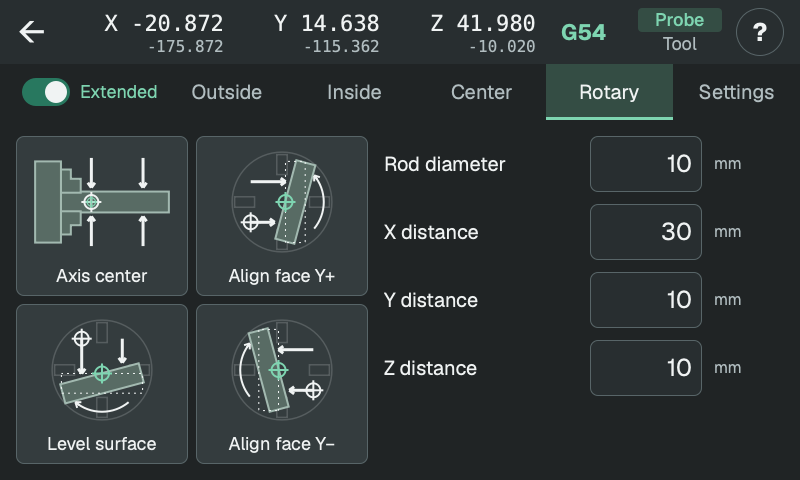
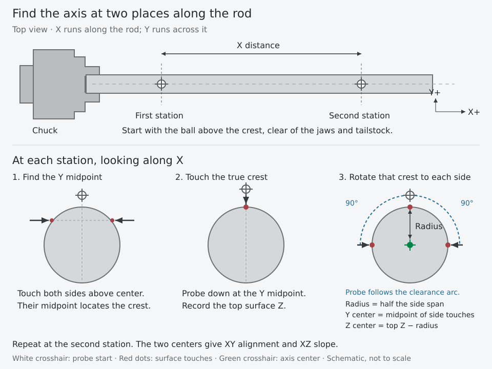
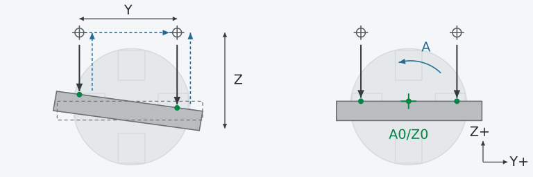
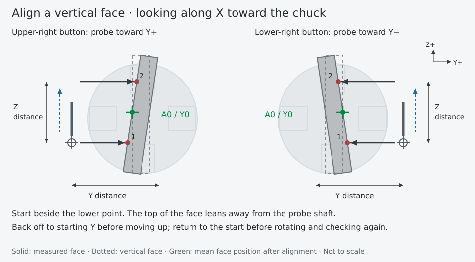
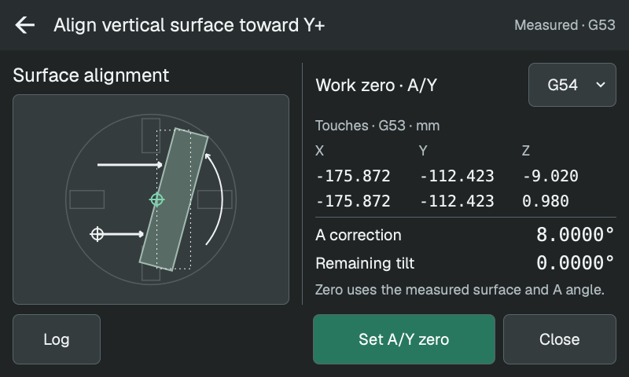

# Rundaxel

Knappen för axelcentrum mäter en stång som sitter i chucken. De andra tre knapparna vrider en plan yta tills den är vågrät eller lodrät.

<!-- guide-only -->

<!-- /guide-only -->

## Rundaxelns centrum

Spänn fast en rak rundstång i chucken. Placera kulan ovanför en slät del, ungefär centrerat i Y. Starthöjden i Z måste ge frigång över stången vid båda mätlägena.

- **Stångdiameter:** anger höjd och sidavstånd för de första mätningarna från sidorna.
- **X-avstånd:** sträckan med tecken till det andra mätläget. Båda lägena måste vara på stången, fria från backar och dubbdocka. Större avstånd gör små fel i axelvinkeln lättare att mäta.

Vid varje X-läge hittar proben toppen och ungefärligt Y-centrum och mäter sedan toppen igen vid detta Y. Den vrider A till +90° och −90° i förhållande till A:s startvinkel medan den följer stången och känner av samma del av ytan från båda sidor. Mätvärdena ger rotationscentrum även om stången sitter ocentrerat i chucken.

Proben återgår till det första X-läget med Z och A i startläget. Resultaten visar båda axelcentrumen och deras vinklar i förhållande till X-rörelsen:

- **Nollställ Y/Z:** använd det första centrumet som Y0/Z0; behåll X-nollpunkten.
- **Sätt X/Y-rotation:** rikta valt WCS efter den uppmätta axeln i X/Y. Kräver community-firmware.

## Vågrät yta

Börja ovanför Y−-änden av en plan yta, inom 20° från vågrätt läge. Lämna tillräcklig frigång vid starthöjden i Z för att ytan ska kunna vridas.

- **Y-avstånd:** avstånd från den första till den andra kontakten i Y+.
- **Z-avstånd:** största söksträckan nedåt från starthöjden i Z vid varje punkt.

Proben probar båda punkterna, återgår till startläget i Y/Z, vrider A för att ta bort lutningen och mäter igen. Båda punkterna måste fortfarande ligga på ytan efter rotationen.

Proben slutar i startläget för X/Y/Z med A vid den korrigerade vinkeln. **Nollställ A/Z** använder den A-vinkeln och medelvärdet av de två ythöjderna.

## Lodrät yta

Använd Y+- eller Y−-bilden för riktningen mot ytan. Börja bredvid den **nedre** mätpunkten med den övre delen lutande bort från probskaftet, inom 20° från lodrätt läge.

- **Y-avstånd:** största söksträckan från startläget i Y mot ytan.
- **Z-avstånd:** avstånd uppåt från den nedre till den övre kontakten.

Proben probar den nedre punkten, backar till startläget i Y, kör uppåt och probar den övre punkten. Den återgår till startläget i Y/Z innan den vrider A och kontrollmäter. Båda mätpunkterna måste fortfarande ligga på ytan.

Proben slutar i startläget för X/Y/Z med A vid den korrigerade vinkeln. **Nollställ A/Y** använder den A-vinkeln och medelvärdet av de två ytpositionerna.

<!-- guide-only -->

[Arbetskoordinatsystem och sparade resultat](results.md)
<!-- /guide-only -->
