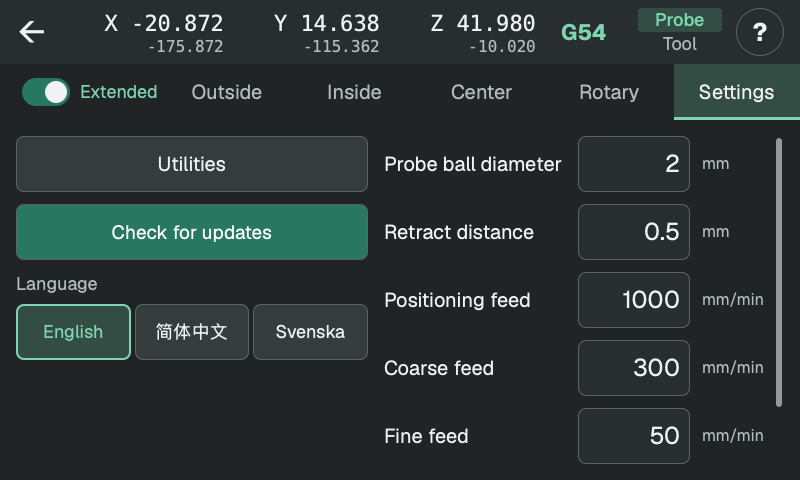

# 设置

接受数值时即保存设置，重启后仍保留。距离单位为 mm；直线进给单位为 mm/min。

<!-- guide-only -->

<!-- /guide-only -->

## 测球直径与回退距离

**测球直径**按测球半径修正触碰表面的坐标。此补偿独立于机床上测头相对主轴的标定。

**回退距离**是每次粗测和精测触碰后的退离距离，必须足以让测头解除触发。精测搜索会返回粗测触碰位置，并允许再越过 0.5 mm。

## 进给

- **粗测进给：**首次搜索表面。
- **精测进给：**第二次触碰，用于测量。较低速度可减小测头挠曲和停止误差。
- **定位进给：**测点之间移动和回退的速度。
- **回转进给：**A 轴旋转速度，单位为度/分钟。

## 语言

可选择 English、简体中文或 Svenska。尚未选择时，界面使用 CNC 屏幕的语言；本地预览使用计算机的语言。

## 更新

**检查更新**打开版本说明和安装程序。**开发版**选择滚动构建，而非正式版；安装后仍保留此选择。

**自动检查更新**在每次打开界面时检查所选更新渠道。设置和更新按钮上的绿点表示有新版本。安装更新会重启界面。

## 辅助功能

**测量记录**重新打开已保存的测量。**导出日志**将测量记录和诊断日志复制到已挂载的 USB 存储设备。**清除日志**经确认后删除这些记录和日志。

**测头重复性**反复测量 L 形角板侧壁和台面，以比较读数；可选择在各次测量之间收回测头和执行回零。

<!-- guide-only -->
[测量记录与日志](history.md)

[重复性检查](repeatability.md)

[编辑数值](editing.md)
<!-- /guide-only -->
